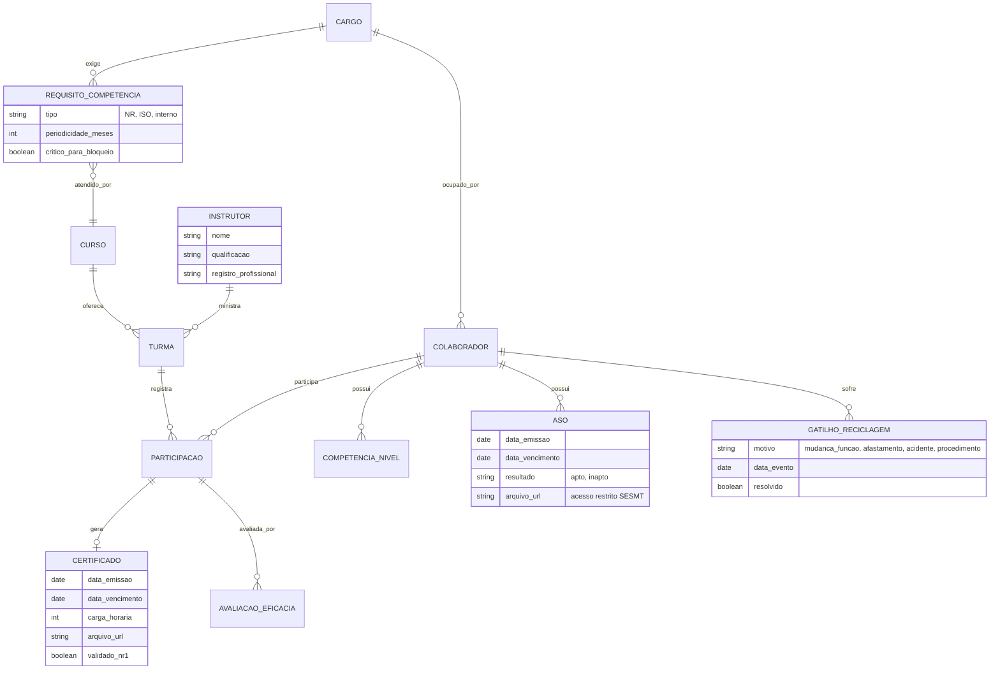

# Dossiê Estratégico: Módulo de Gestão de Treinamentos e Competências (Vigen)

## 1. Visão Geral
Este documento apresenta a arquitetura conceitual e estratégica para o módulo de Treinamentos e Competências do **Vigen**, desenhado para atender aos requisitos da **ISO 9001:2015 (Cláusulas 7.2 - Competência e 7.3 - Conscientização)** e às normativas de **SST (Saúde e Segurança do Trabalho - NRs e ASOs)**.

O objetivo é transformar a conformidade legal, muitas vezes vista como burocrática, em uma experiência proativa por meio de **bloqueios sistêmicos, evidências prontas para auditoria e inteligência de dados**.

> **Status (2026-09-27):** MVP implementado no sistema — gatilhos de reciclagem, treinamento crítico com aptidão calculada, avaliação de eficácia, conformidade NR-1 da sessão, modo auditoria, obrigatoriedade por função, alertas escalados (60/30/0) e conscientização 7.3 pela ciência de documento. Pendentes: ASO/LGPD, bloqueio de alocação em escalas, crachá digital (adiado) e itens v2/v3+.

---

## 2. Escopo: MVP x Futuro

| Fase | Funcionalidades |
|---|---|
| **MVP** | Matriz de requisitos por função/risco, matriz de temporalidade configurável, gatilhos de reciclagem, alertas escalados, bloqueio lógico (Apto/Inapto), validação de certificados de NR, avaliação de eficácia, Audit-Mode |
| **v2** | Matriz de Versatilidade (heatmap + montagem de turnos), integração eSocial (S-2220), app/WhatsApp para envio de certificados e quizzes |
| **v3+** | Gamificação, integração IoT/catracas, IA de sugestão de reskilling |

---

## 3. Arquitetura de Negócios e Compliance

### A. Conformidade com ISO 9001 (7.2 e 7.3)
Para atender à norma, o SaaS deve cobrir o ciclo completo de competência, indo além da simples "lista de presença":
* **Mapeamento:** Vincular Cargos/Funções a requisitos de escolaridade, experiência e treinamentos obrigatórios.
* **Avaliação de Eficácia:** Provas/quizzes logo após o treinamento e avaliação prática pelo supervisor em prazo configurável (ex: 30/60/90 dias), gerando a evidência de que o conhecimento foi aplicado.
* **Conscientização (7.3):** Registro de ciência da política da qualidade, objetivos e impacto do trabalho do colaborador — pode reaproveitar o mesmo mecanismo de quizzes.
* **Gestão de Evidências (Audit-Ready):** Central de documentos rastreável, de fácil exportação para auditores externos.

### B. Controle de NRs e ASOs
* **Matriz de Temporalidade configurável por Função/Risco** — nunca fixa por tipo de documento. Referências padrão (editáveis por empresa):

| Requisito | Periodicidade de referência | Observação |
|---|---|---|
| NR-10 (Eletricidade) | Reciclagem bienal | + gatilhos de evento |
| NR-35 (Altura) | Reciclagem bienal | + retorno de afastamento > 90 dias |
| NR-33 (Espaço Confinado) | Reciclagem anual | |
| NR-12 (Máquinas) | Conforme análise de risco / mudanças | Sem prazo fixo universal |
| ASO periódico (NR-7) | Definido no PCMSO (anual ou bienal, conforme idade e risco) | Parametrizado a partir do PCMSO |

* **Gatilhos de Reciclagem por Evento** (além do vencimento por prazo):
  * Mudança de função ou de atividade
  * Retorno de afastamento (ex: NR-35 — acima de 90 dias)
  * Acidente ou incidente grave relacionado à atividade
  * Mudança de procedimento, equipamento ou processo
* **Validação de Certificados de NR (NR-1, item 1.7 e Anexo II):** Ao cadastrar um certificado, o sistema checa carga horária mínima, conteúdo programático, instrutor/responsável técnico qualificado, assinatura e — se EAD/semipresencial — o atendimento ao Anexo II. Certificado incompleto não conta como válido.
* **Alertas Escalados:** Notificações via E-mail/WhatsApp (ex: 60 dias → colaborador; 30 dias → gestor e RH; 0 dias → bloqueio imediato).

### C. Bloqueio Operacional
* **Status calculado, nunca armazenado:** A aptidão é derivada em tempo real das datas de vencimento e dos gatilhos pendentes — evita status desatualizado.
* **Bloqueio lógico:** Colaborador inapto não pode ser alocado em escalas/turnos de atividades de risco correspondentes.

### D. LGPD — Dados de Saúde
O ASO é **dado pessoal sensível** (saúde). Regras obrigatórias:
* Supervisores e inspetores veem **apenas "Apto/Inapto" e a data de validade** — nunca o conteúdo clínico, exames ou CID.
* Acesso ao documento completo restrito ao SESMT/médico do trabalho, com log de acesso.
* O motivo de bloqueio exibido em campo deve ser genérico para ASO ("ASO pendente"), sem detalhes médicos.

### E. Integração eSocial (v2)
* **S-2220 (Monitoramento da Saúde do Trabalhador):** Gerar o espelho de dados do ASO para envio pelo RH.
* Conecta-se naturalmente com o **S-2210 (CAT)** do módulo de incidentes.

---

## 4. Experiência do Usuário (UX) e Engajamento

### A. Matriz de Versatilidade (Skills Matrix) Interativa — v2
Substituindo planilhas estáticas por um **Grid Visual (Heatmap)** em tempo real.
* **Visualização:** Eixo X (Processos/Habilidades) x Eixo Y (Colaboradores). Cores quentes para gaps e cores frias/verdes para alta proficiência.
* **Níveis de Proficiência (modelo ILUO, oriundo do Sistema Toyota de Produção):**
  1. **I** — Em treinamento (Iniciante)
  2. **L** — Opera com supervisão (Básico)
  3. **U** — Opera com autonomia (Intermediário)
  4. **O** — Capacitado para treinar outros (Instrutor/Multiplicador)
* **Drag-and-Drop:** Montagem de equipes de turno garantindo pelo menos um "Nível O" por processo crítico — e respeitando o bloqueio de inaptos.

### B. Gamificação — v3+
* **Microlearning:** Reciclagens divididas em pílulas curtas semanais.
* **Badges:** Selos como "Guardião da Qualidade", "Mestre NR-10".
* **Rankings de Turno/Equipe:** Equipes 100% em dia, podendo atrelar a bônus ou SIPAT Digital gamificada.

---

## 5. Arquitetura de Dados (Modelagem Sugerida)

> **Nota:** A aptidão do colaborador **não é uma coluna** — é calculada (view/função) cruzando requisitos críticos do cargo × certificados válidos × ASO válido × gatilhos não resolvidos.

---

## 6. Diferenciais Competitivos para o Vigen

1. **Audit-Mode com 1 Clique (MVP):** Painel restrito gerado automaticamente para o auditor da ISO, mostrando apenas evidências e gráficos de eficácia, poupando horas de busca em pastas.
2. **Validação Legal Embutida (MVP):** O sistema sabe o que torna um certificado de NR válido (NR-1) e quando uma reciclagem é exigida por evento — não só por prazo.
3. **Privacidade por Design (MVP):** Bloqueio operacional sem expor dado de saúde — conformidade SST e LGPD ao mesmo tempo.
4. **App Mobile-First para o Chão de Fábrica (v2):** O colaborador envia foto do certificado ou faz o quiz de eficácia pelo celular, via link de WhatsApp.
5. **Preventive Locking via IoT/Access Control (v3+):** Vínculo da validade documental com catracas e login de máquinas.
6. **IA de Sugestão de Reskilling (v3+):** "Você tem 3 operadores sêniores saindo este ano. Sugiro iniciar a trilha no processo X para o colaborador Y agora."
